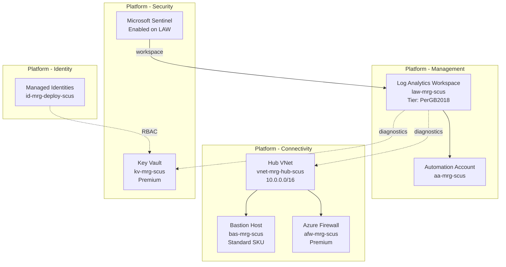

# Azure Resource Visualizer — Enterprise Landing Zone

Examine deployed Azure Landing Zone resources via Resource Graph and generate
comprehensive Mermaid architecture diagrams showing resource relationships.

## When to Use

- Post-deployment visualization of platform or application LZs
- Brownfield assessment — visualizing existing estate before onboarding
- Drift detection — comparing live state to expected architecture
- Documentation (Step 7) — generating as-built architecture diagrams

## Workflow

### Step 1: Scope Selection

Determine visualization scope from the estate state:

| Scope | Query Pattern | Output |
|---|---|---|
| Full estate | All LZ subscriptions | Estate-level topology diagram |
| Platform LZ | Single platform subscription | Platform component diagram |
| Application LZ | Single app subscription | Workload architecture diagram |
| Resource group | Single RG | Detailed resource diagram |

```bash
# List platform LZ subscriptions (from environments/subscriptions.json)
az account list --query "[?tags.Environment=='platform']" --output table

# List all resource groups in a subscription
az group list --subscription "ME-MngEnvMCAP084543-ytesfaye-3" --output table
```

### Step 2: Resource Discovery via Resource Graph

Use Azure Resource Graph for cross-subscription inventory:

```kql
// All resources across platform LZ subscriptions
resources
| where subscriptionId in ("sub-mgmt-id", "sub-conn-id", "sub-ident-id", "sub-sec-id")
| summarize count() by type, resourceGroup, subscriptionId
| order by count_ desc

// Network topology — VNets and peering
resources
| where type == "microsoft.network/virtualnetworks"
| extend addressSpace = properties.addressSpace.addressPrefixes
| project name, resourceGroup, subscriptionId, addressSpace

// Connectivity relationships
resources
| where type in~ (
    "microsoft.network/virtualnetworks",
    "microsoft.network/bastionhosts",
    "microsoft.network/azurefirewalls",
    "microsoft.network/virtualnetworkgateways",
    "microsoft.network/privatednszones"
)
| project name, type, resourceGroup, properties
```

### Step 3: Relationship Mapping

Identify connections between resources:

| Relationship Type | How to Detect |
|---|---|
| Network (VNet → Subnet → NIC) | `properties.subnets`, `properties.ipConfigurations` |
| Peering (VNet ↔ VNet) | `microsoft.network/virtualnetworks/virtualnetworkpeerings` |
| Diagnostic settings | `microsoft.insights/diagnosticSettings` on each resource |
| Private endpoints | `microsoft.network/privateendpoints` → `privateLinkServiceConnections` |
| Managed Identity | `identity.principalId` on resources |
| Key Vault references | App settings, ARM template parameters |
| Log Analytics | `properties.workspaceId` in diagnostic settings |

### Step 4: Diagram Generation

Generate Mermaid diagrams organized by CAF design area:



### Step 5: File Output

Create visualization artifacts:

| File | Content |
|---|---|
| `agent-output/{customer}/diagrams/{scope}-architecture.md` | Full markdown with embedded Mermaid |
| `agent-output/{customer}/diagrams/{scope}-inventory.md` | Resource inventory table |

---

## Diagram Construction Rules

### Grouping by Platform LZ

```text
Management    → Log Analytics, Automation, Monitor resources
Connectivity  → Hub VNet, Bastion, Firewall, DNS, Gateways
Identity      → Managed Identities, Entra resources
Security      → Key Vault, Sentinel, Defender resources
```

### Visual Conventions

| Element | Mermaid Syntax | Usage |
|---|---|---|
| Solid arrow | `-->` | Data flow, dependency |
| Dashed arrow | `-.->` | Diagnostic/monitoring connection |
| Thick arrow | `==>` | Critical path (e.g., firewall routing) |
| Subgraph | `subgraph "Name"` | Logical grouping by LZ or layer |
| Node details | `<br/>` | SKU, tier, address space in labels |

### Node Label Format

```text
ResourceType<br/>resource-name<br/>Key Detail (SKU/Tier/Size)
```

### Required Elements in Every Diagram

1. All resource groups with their resources
2. Cross-resource relationships (network, identity, monitoring)
3. CAF design area labels on subgraphs
4. SKU/tier annotations for cost-relevant resources
5. Security posture indicators (private endpoints, managed identity)

---

## Integration with Other Skills

| Skill | Integration |
|---|---|
| `brownfield-discovery` | Provides initial resource inventory for visualization |
| `azure-diagnostics` | KQL queries for Resource Graph discovery |
| `mermaid` | Diagram syntax and rendering conventions |
| `assessment-report` | Visualization embedded in assessment outputs |

---

## Constraints

- **Read-only** — never create, modify, or delete Azure resources
- **Resource Graph preferred** — faster than per-resource ARM queries
- All Azure queries via GitHub Actions or MCP tools — not local `az` CLI in prod
- Diagrams must render in GitHub markdown (standard Mermaid support)
- Include `last_updated` timestamp in generated files
- For 50+ resources: split into multiple diagrams by CAF design area
