# Mermaid Diagrams

Skill for generating Mermaid diagrams embedded in markdown fences. Used for
inline documentation diagrams — flowcharts, sequences, state machines, ER
diagrams, and Gantt charts. For architecture diagrams with Azure service icons,
use the `drawio` skill instead.

## When to Use Mermaid

- Inline diagrams inside markdown documents (`.md`)
- Workflow flowcharts for operational runbooks
- Sequence diagrams for auth flows and API interactions
- Gantt charts for deployment schedules
- State diagrams for landing zone lifecycle
- Management group hierarchy visualizations
- Policy assignment flow diagrams

## When NOT to Use Mermaid

- Architecture diagrams needing Azure service icons → use `drawio`
- WAF score charts, cost donuts → use `python-diagrams`
- Standalone diagram files for external consumption → use `drawio`

## Syntax Reference

### Flowcharts

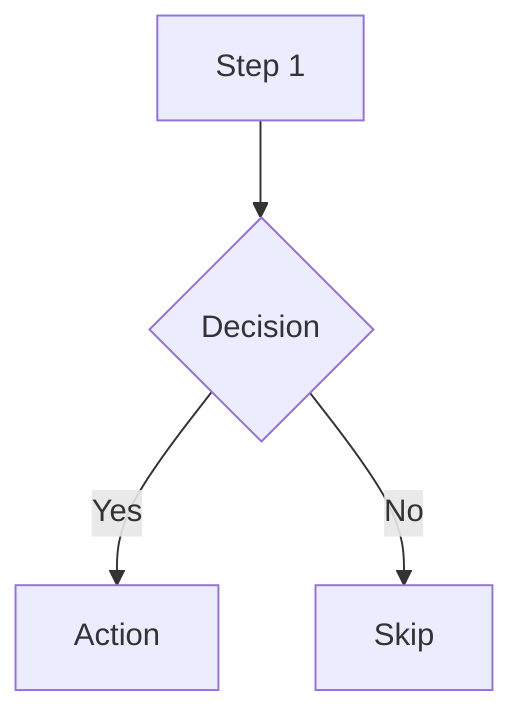

Use `graph TB` (top-to-bottom) for vertical layouts.
Use `graph LR` (left-to-right) for horizontal layouts.
Use subgraphs for logical grouping:

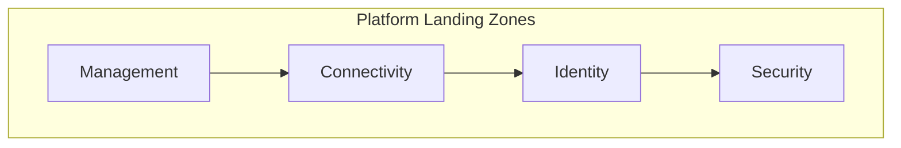

### Sequence Diagrams

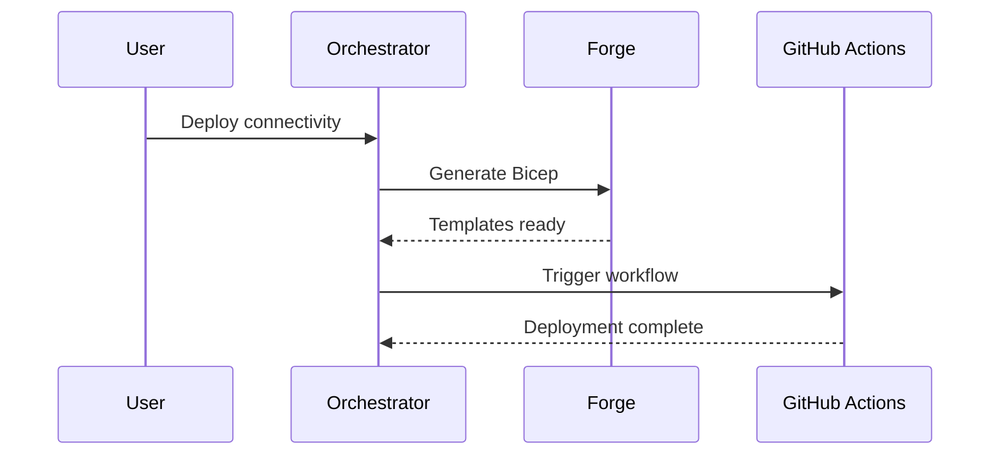

### Gantt Charts

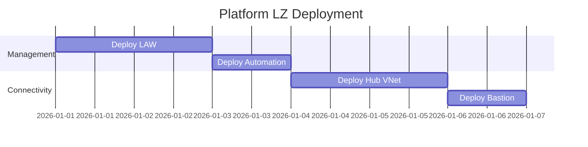

### State Diagrams

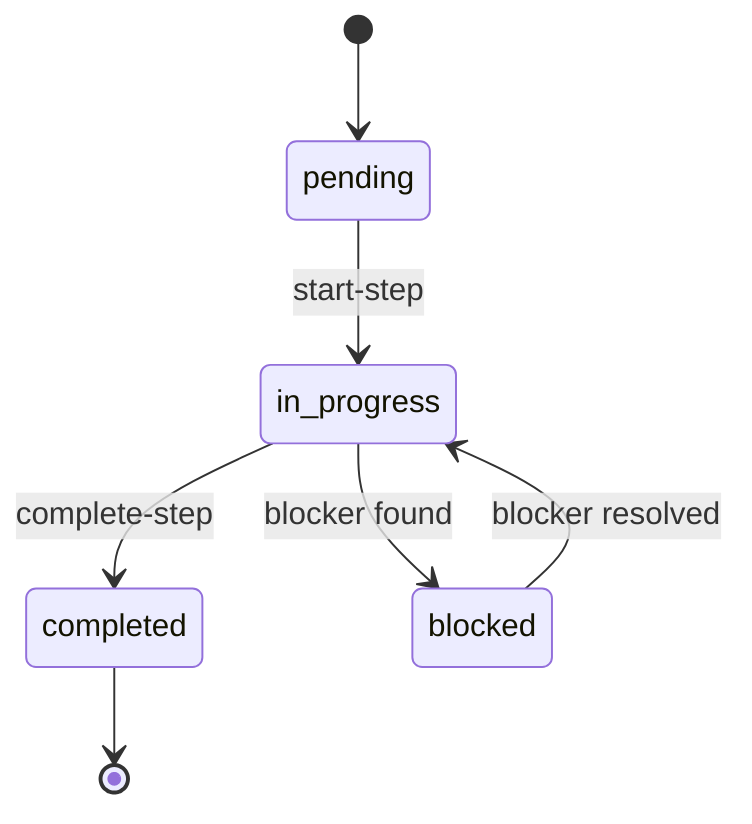

### ER Diagrams

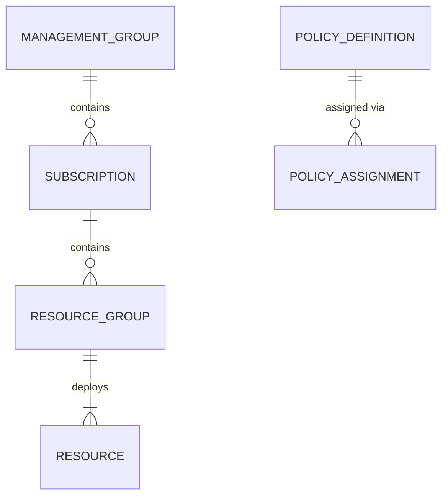

## ALZ-Specific Patterns

### Management Group Hierarchy

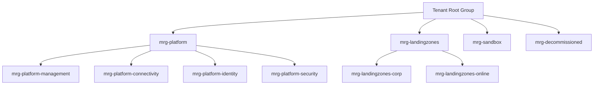

### APEX Workflow

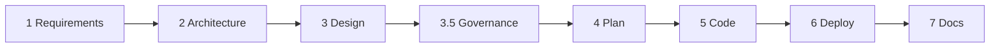

### Deployment Pipeline

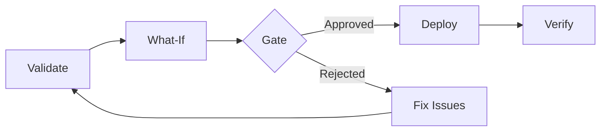

## Theming (Dark Mode Compatible)

Include a neutral theme directive for consistent rendering:

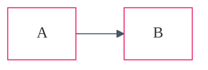

## Node Styling

Use `classDef` for consistent styling:

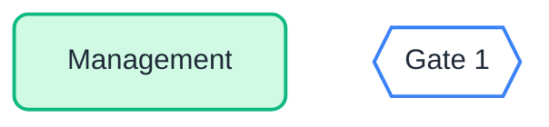

## Guardrails

**DO:** Use fenced code blocks with `mermaid` language tag · Include theme
directives for dark mode · Use `graph TB` for vertical layouts · Use subgraphs
for grouping · Use descriptive connection labels.

**DON'T:** Use Mermaid for WAF/cost charts (use `python-diagrams`) · Use Mermaid
for architecture diagrams needing Azure icons (use `drawio`) · Create diagrams
with >30 nodes (split into multiple diagrams) · Omit theme directives.
