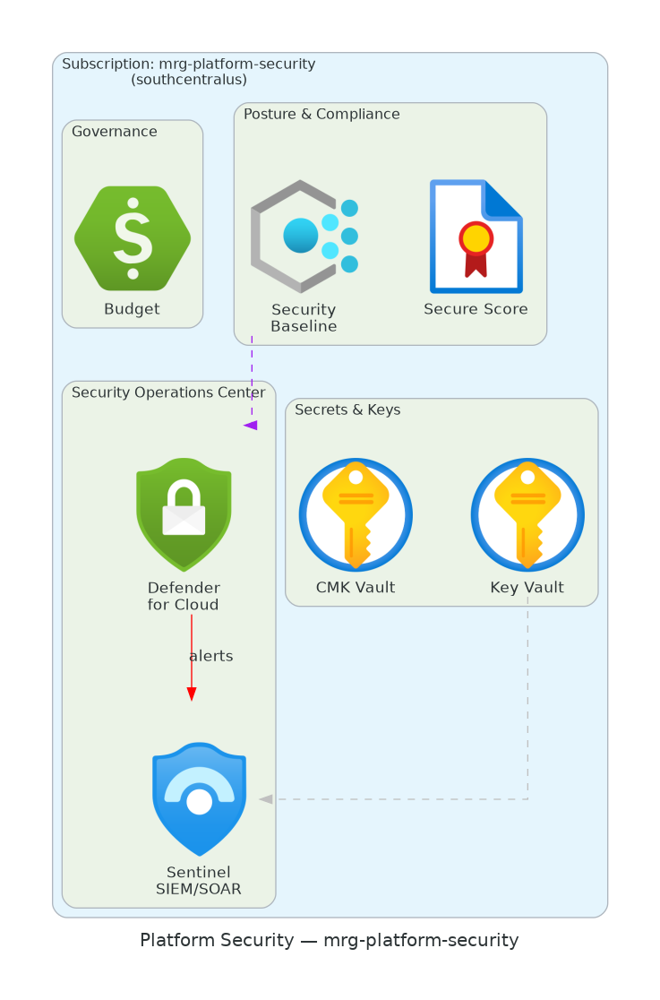

# As-Built Technical Design Document

## security

> **Profile**: platform-security · **Environment**: prod · **Generated**: 2026-04-17 22:47 UTC

| Field | Value |
|-------|-------|
| Subscription | mrg-platform-security |
| Subscription ID | `<SUB-4-ID>` |
| Location | southcentralus |
| IaC Framework | Bicep |
| Deployment ID | (manual) |
| Document Version | 1.0 (auto-generated) |

---

## 1. Executive Summary

This Technical Design Document (TDD) describes the as-built state of the
'security' landing zone deployed to subscription
'mrg-platform-security' in southcentralus.
This landing zone provides dedicated SecOps with Sentinel, Defender for Cloud (all plans), SOAR playbooks, and incident response.

The deployment was executed using Bicep via the GitHub Actions
CI/CD pipeline with OIDC authentication and environment approval gates.
All resources comply with the CAF enterprise-scale baseline policies.

### Key Facts

| Attribute | Value |
|-----------|-------|
| Landing Zone | security |
| Profile | platform-security |
| Subscription | mrg-platform-security (`<SUB-4-ID>`) |
| Region | southcentralus |
| Environment | prod |
| IaC Framework | Bicep |
| Deployment ID | (manual/CLI) |

---

## 2. Architecture Diagram

The following diagram illustrates the as-built architecture of this landing zone,
including all deployed resources, networking topology, and security controls.
Icons follow the official Microsoft Azure Architecture Icon set.

*Figure 1: security Architecture — As-Built*

---

## 3. Resource Inventory

Complete inventory of Azure resources deployed in this landing zone,
queried from Azure Resource Graph at generation time.

### 3.1 Resource Summary by Type

| Resource | Count | Configuration |
|----------|-------|---------------|
| Sentinel Workspace (SecOps) | 1 | Dedicated for security team |
| Defender for Cloud | 1 | All plans enabled |
| SOAR Playbooks (Logic Apps) | 5+ | Auto-remediation |
| Alert Rules | 20+ | Sev 0-2 incident triggers |
| Key Vault (Forensics) | 1 | Evidence preservation |

---
## 4. Network Topology

This landing zone uses a spoke virtual network peered to the central hub in the Connectivity subscription. All egress traffic routes through Azure Firewall. DNS resolution uses the hub's Private DNS Zones.

| Network Component | Configuration |
|-------------------|---------------|
| VNet CIDR | Peered to Hub |
| Connectivity | Log ingestion from all subscriptions |

---
## 5. Security Posture

Security controls applied to this landing zone as part of the CAF
enterprise-scale baseline. All controls are enforced via Azure Policy
and validated during deployment.

### 5.1 Non-Negotiable Security Rules

| # | Rule | Description | Status |
|---|------|-------------|--------|
| 1 | Diagnostic Settings | All resources ship logs to central Log Analytics workspace | Enforced |
| 2 | HTTPS Only | All web endpoints require TLS 1.2+ | Enforced |
| 3 | No Public IPs | Disallowed on compute (except for allowed profiles) | Enforced |
| 4 | Encryption at Rest | All storage & databases use platform-managed or CMK encryption | Enforced |
| 5 | NSG on Every Subnet | Network Security Groups required on all subnets | Enforced |
| 6 | Defender for Cloud | Enabled on all resource types (per profile plan count) | Enforced |

### 5.2 Defender for Cloud Plans

| Defender Plan | Status |
|---------------|--------|
| Servers | Enabled |
| Storage | Enabled |
| Key Vaults | Enabled |
| ARM | Enabled |
| DNS | Enabled |
| Containers | Enabled |

### 5.3 Azure Policy Assignments

The following policy initiatives are assigned at the management group level
and inherited by this subscription:

| Initiative | Scope |
|------------|-------|
| CAF Foundation | Core governance (tagging, allowed locations, allowed SKUs) |
| CAF Security Baseline | CIS benchmark controls, encryption, network rules |
| Defender for Cloud | Auto-enable Defender plans and security configurations |
| Monitoring | Diagnostic settings, Log Analytics agent, dependency agent |
| Network | NSG rules, flow logs, VNet service endpoints |

---

## 6. Compliance Status

Post-deployment compliance scan results. The CI/CD pipeline validates
compliance after every deployment and fails the pipeline if compliance
falls below 80%.

### 6.1 Compliance Summary

| Metric | Value |
|--------|-------|
| Compliance Percentage | Populated at deployment time |
| Total Policies Evaluated | Populated at deployment time |
| Compliant Resources | Populated at deployment time |
| Non-Compliant Resources | Populated at deployment time |
| Exempt Resources | Populated at deployment time |

> *This section is auto-populated with live data when the TDD is
> generated as part of the CI/CD pipeline (post-deployment verify stage).
> For pre-deployment TDDs, values show 'Populated at deployment time'.*

---

## 7. Cost Governance

| Control | Configuration |
|---------|---------------|
| Monthly Budget | $8,000 |
| Alert Thresholds | 80/100/120% |
| Alert Recipients | Platform team + subscription owner |
| Cost Anomaly Detection | Enabled |
| Tag Requirements | Environment, Owner, CostCenter, Project |

---

## 8. Operational Model

### 8.1 Monitoring & Alerting

| Scan Type | Frequency | Source |
|-----------|-----------|--------|
| Compliance Scan | Every 30 minutes | monitor.yml |
| Drift Detection | Every hour | monitor.yml |
| Full Audit Report | Daily 6 AM UTC | monitor.yml |
| Cost Alerts | Real-time | Azure Cost Management |
| Security Alerts | Real-time | Defender for Cloud → Sentinel |

### 8.2 Change Management

All infrastructure changes follow the GitOps workflow:

| Step | Action | Responsible |
|------|--------|-------------|
| 1 | Create feature branch | Developer |
| 2 | Push changes & open PR | Developer |
| 3 | Automated PR validation (lint, security, cost, what-if) | 5-pr-validate.yml |
| 4 | Peer review & approval | Platform team |
| 5 | Merge to main | Developer |
| 6 | Trigger deploy workflow | Platform team |
| 7 | Environment approval gate | Required reviewers |
| 8 | Deployment + post-deploy verification | Reusable pipeline |
| 9 | TDD auto-generated | tdd_generator.py |

### 8.3 Disaster Recovery

| Component | Protection | Recovery Time |
|-----------|------------|---------------|
| IaC Templates | Git repository | Minutes |
| Configuration | subscriptions.json | Minutes |

---

## 9. Appendix

### 9.1 Full Estate Architecture

Overview of the complete Azure Landing Zone estate showing all platform
and application landing zones.

*Figure 2: Full Azure Landing Zone Estate*

### 9.2 Document Revision History

| Version | Date | Author | Changes |
|---------|------|--------|---------|
| 1.0 | 2026-04-17 | Auto-generated by CI/CD pipeline | Initial as-built TDD |

### 9.3 References

| Document | Location |
|----------|----------|
| CAF Enterprise-Scale | <https://aka.ms/caf/enterprise-scale> |
| Azure Landing Zone Accelerator | <https://aka.ms/alz/accelerator> |
| Landing Zone Profiles | `src/config/landing_zone_profiles.yaml` |
| Subscription Config | `environments/subscriptions.json` |
| CI/CD Workflows | `.github/workflows/` |